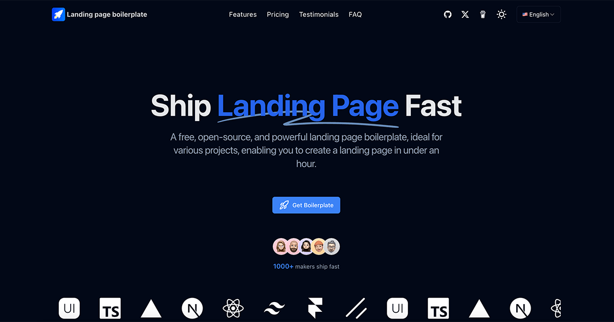

🌍 *[English](README.md) ∙ [简体中文](README-zh.md)*


# [Landing page boilerplate](https://landingpage.weijunext.com/)

An open-source, free, and beautifully designed landing page template. By simply replacing or adjusting the icons and text, you can publish your own product landing page.

Demo address：https://landingpage.weijunext.com

Used this template? Get featured in [our Showcase](https://landingpage.weijunext.com/#Showcase)! Submit your site via [GitHub Issues](https://github.com/weijunext/landing-page-boilerplate/issues) for a free dofollow link.

Blog: 
[我为独立开发者开发落地页模板（一）](https://juejin.cn/post/7344567650457010191)  
[我为独立开发者开发落地页模板（二）](https://juejin.cn/post/7350200488455520267)

[](https://landingpage.weijunext.com/)

## Tech Stack 

Landing page boilerplate is built on the following stack:

- Next.js – Frontend/Backend
- TailwindCSS – Styles
- Google Analytics
- Vercel - Hosting


## Running Locally

After cloning the repo, you need to copy the `.env.example` file to create a `.env` file and fill in the required fields.

Then, run the application in the command line and it will be available at `http://localhost:3000`.

```bash
npm run dev
```

## Build Your Project

Edit these files:
- `.env` or `.env.local`
- `config/site.ts`, fill in your website information.
- `public`, change logo file
- `public/robots.txt`
- `app/sitemap.ts`


